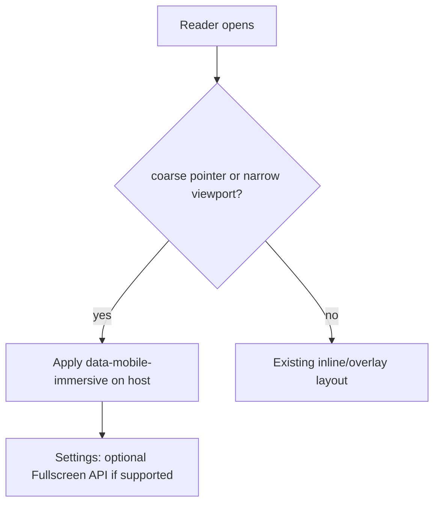
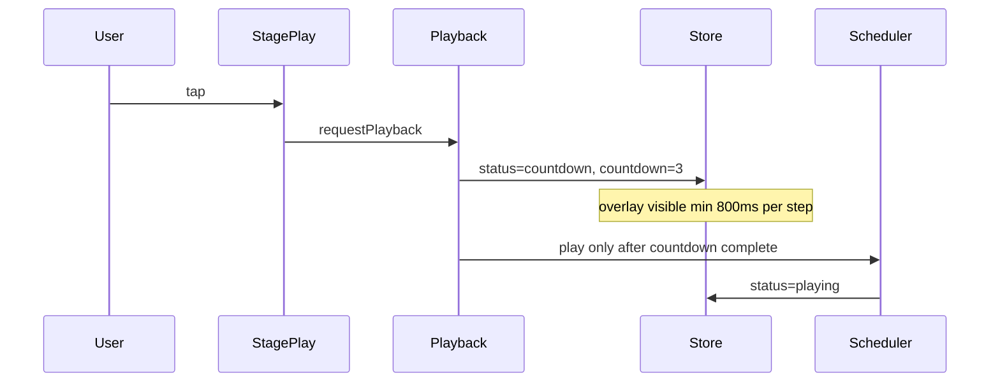

# Mobile UI overhaul and iOS countdown fix

Reduce mobile UI clutter with an immersive full-viewport layout, a settings panel (replacing the theme toggle), YouTube-style auto-hiding bottom toolbar, and fixes for the iOS Safari countdown bug.

## Status

| Task | Status |
|---|---|
| Fix countdown (iOS Safari) | done |
| Prefs infrastructure | done |
| Settings panel | done |
| Mobile immersive layout | done |
| Toolbar auto-hide | done |
| Mobile polish + optional Fullscreen API | done |
| Mobile Playwright tests | done |

---

## 1. Fullscreen investigation (mobile)

**Finding:** The native [Fullscreen API](https://developer.mozilla.org/en-US/docs/Web/API/Fullscreen_API) is **unreliable for custom elements on iOS Safari**. Historically only `<video>` worked; newer iOS versions add partial `requestFullscreen()` support on arbitrary elements, but behavior varies (user gesture required, awkward exit, no guarantee in embedded article contexts). Android Chrome and desktop browsers support it well.

**Recommendation for this widget:**

| Approach | Mobile support | Fit for RSVP reader |
|---|---|---|
| **CSS immersive mode** (`position: fixed; inset: 0; height: 100dvh; safe-area-inset padding`) | All browsers | Primary — works in Shadow DOM, no API permission |
| **Fullscreen API** (feature-detected) | Desktop + Android; iOS partial | Optional "Enter fullscreen" in settings when `element.requestFullscreen` exists |
| **PWA `display: standalone`** | Installed apps only | Out of scope |

**Decision:** **Both inline and overlay modes** will auto-enter **CSS immersive mode** on mobile (`pointer: coarse` or `max-width: 480px`). This gives a fullscreen-like reading surface without depending on iOS Fullscreen API.



**Files:** `src/component/styles.css`, new `src/ui/immersive.ts`, mount from `src/component/RsvpReader.ts`.

Immersive CSS sketch:

- `:host([data-mobile-immersive]) .root { position: fixed; inset: 0; height: 100dvh; max-height: 100dvh; margin: 0; border-radius: 0; padding: env(safe-area-inset-top) env(safe-area-inset-right) env(safe-area-inset-bottom) env(safe-area-inset-left); z-index: 2147483646; }`
- Stage grows with `flex: 1` so the word area dominates
- Meta/progress can slim down or tuck under stage on mobile

---

## 2. Replace theme toggle with settings button

Remove `mountThemeToggle()` from `src/ui/Controls.ts`. Replace with a single **settings gear** button in `top-right` slot (before Close).

- Add `icons.settings` (gear SVG) in `src/ui/icons.ts`
- New i18n keys: `control.settings`, `control.label.settings`, `settings.title`, `settings.font`, `settings.fontSize`, `settings.theme`, `settings.alwaysShowToolbar`, `settings.fullscreen`
- Button opens/closes settings panel; `aria-expanded`, `aria-controls`

---

## 3. Settings panel

New module `src/ui/SettingsPanel.ts` — popover/sheet anchored below the settings button on desktop; **bottom sheet** on mobile (slides up, backdrop dismiss).

**Controls inside panel:**

| Setting | Options | Wiring |
|---|---|---|
| Theme | Light / Dark (segmented) | `store.set({ theme })` + existing `persistThemeChoice()` in `src/theme/theme.ts` |
| Font | Sans / Serif / Mono / Dyslexic | `applyFont(host, font)` — already in `src/theme/theme.ts` |
| Font size | S / M / L | New `--rsvp-word-size` via `data-font-size` on host |
| Always show toolbar | Toggle | New pref, disables auto-hide (see §4) |
| Fullscreen (optional) | Button, only if API supported | `host.requestFullscreen()` with graceful fallback message |

**Persistence:** extend `src/utils/safe-storage.ts` usage via new `src/utils/prefs.ts`:

```ts
// rsvp-reader:prefs
{ theme, font, fontSize, alwaysShowToolbar }
```

Load on mount in `src/component/RsvpReader.ts`; save on each change. Site-owner `data-font` / `theme` attrs set initial defaults; user prefs override at runtime.

**Types:** extend `src/core/types.ts` with `FontSizePreference = 's' | 'm' | 'l'` and add `font`, `fontSize`, `alwaysShowToolbar` to reader state or a parallel prefs slice subscribed by UI modules.

**Tokens:** add to `src/theme/tokens.css`:

```css
:host([data-font-size="s"]) { --rsvp-word-size: clamp(1.5rem, 5vw, 2.5rem); }
:host([data-font-size="l"]) { --rsvp-word-size: clamp(2.5rem, 8vw, 4rem); }
```

**Template:** add panel scaffold in `src/component/template.ts` (`[data-settings-panel]`, backdrop).

---

## 4. Auto-hide bottom toolbar (mobile, YouTube-style)

New module `src/ui/ToolbarVisibility.ts`.

**Behavior (mobile only):**

- **Default:** bottom toolbar visible on load
- **During playback:** auto-hide after ~3s idle (no toolbar interaction)
- **Tap stage** (not toolbar buttons): toggle show/hide
- **When `alwaysShowToolbar` pref is true:** never auto-hide; stage tap does nothing
- **When settings panel open:** force toolbar visible
- **When idle / countdown / done:** keep toolbar visible (user needs play CTA context)
- Top toolbar (restart, settings, close) stays always visible

**Implementation:**

- Add `data-toolbar-hidden` on `.toolbar-bottom` + CSS transform/opacity transition
- Stage gets `cursor: pointer` + `data-tap-hint` subtle gradient when controls hidden
- Use `pointer: coarse` media query in JS via `matchMedia('(pointer: coarse)')` combined with width check
- Idle timer resets on toolbar touch/click; `passive: true` touch listeners on stage

**Files:** `src/component/styles.css`, `src/component/template.ts` (optional `data-stage-tap-layer` for hit target).

---

## 5. iOS Safari countdown bug

**Likely causes identified in code:**

1. **Reduced motion collapse** — `src/ui/playback.ts` uses `steps = [1]` with **200ms** delay when `prefers-reduced-motion: reduce` (common on iOS). Countdown is effectively invisible.
2. **Layout stacking** — `.countdown` is a flex sibling without `position: absolute` / `z-index`; can lose visibility vs stage CTAs on WebKit paint.
3. **Direct `scheduler.play()` bypasses** — restart in `src/ui/Controls.ts` and keyboard `R` in `src/a11y/keyboard.ts` skip countdown entirely.
4. **`scheduler.play()` accepts `countdown` status** — `src/core/scheduler.ts` does not guard against `status === 'countdown'`, so any stray `play()` call jumps straight to words.

**Fixes:**

| Fix | Detail |
|---|---|
| Overlay countdown | `.countdown { position: absolute; inset: 0; z-index: 2; display: flex; align-items: center; justify-content: center; }` |
| Minimum step duration | Each step shows **≥800ms** even with reduced motion (show "1" or "Go", not 200ms flash) |
| Time-based countdown | Replace chained `setTimeout` with `performance.now()` loop in `runCountdown()` for iOS timer reliability |
| Single play entrypoint | Route restart/R-key through `requestPlayback()` after `scheduler.restart()` |
| Scheduler guard | `play()` no-ops when `status === 'countdown'` |
| iOS tap hygiene | `stage-play` button: `touch-action: manipulation` to reduce double-fire |



---

## 6. Mobile visual declutter (bundled with above)

- Hide **bottom control labels** on mobile when toolbar is in compact/auto-hide mode (icons only saves ~40% vertical space)
- Slim meta row on mobile immersive (single line, smaller type)
- Settings panel absorbs theme toggle width from top bar

---

## 7. Tests

| Test file | Coverage |
|---|---|
| `tests/e2e/countdown.spec.ts` | Add iPhone viewport project; assert countdown visible ≥1s; reduced-motion still shows countdown |
| `tests/e2e/settings.spec.ts` (new) | Open panel, change font/size/theme, reload persists prefs |
| `tests/e2e/mobile-toolbar.spec.ts` (new) | Mobile viewport: toolbar visible on load, hides after timeout, stage tap toggles, `alwaysShowToolbar` disables hide |
| `tests/e2e/core-reader.spec.ts` | Update theme toggle test → settings panel theme change |
| `playwright.config.ts` | Add `webkit` + iPhone device profile for iOS regression |

Configure Playwright with `devices['iPhone 14']` for countdown/toolbar specs.

---

## 8. Bundle impact estimate

- Settings panel + prefs + toolbar visibility + immersive CSS: **~1.5–2 KB gzipped**
- Current bundle ~12.2 KB gzipped; still well under 30 KB budget

---

## Implementation order

1. Fix countdown bug first (isolated, high-impact)
2. Prefs infrastructure + settings panel (replaces theme toggle)
3. Mobile immersive layout
4. Toolbar auto-hide + settings toggle
5. Optional Fullscreen API button (feature-detected)
6. Tests + mobile Playwright profile
